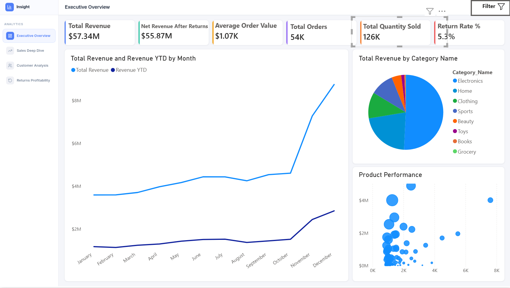
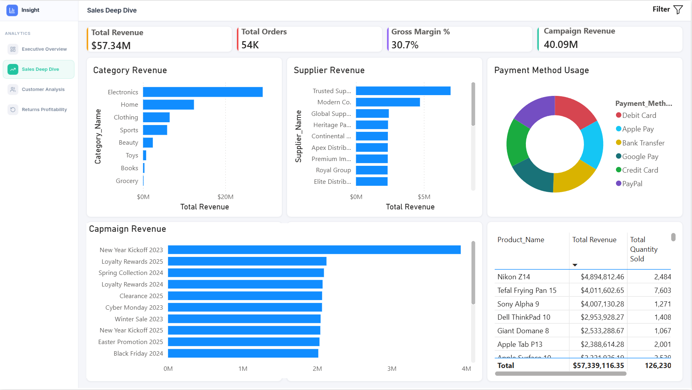
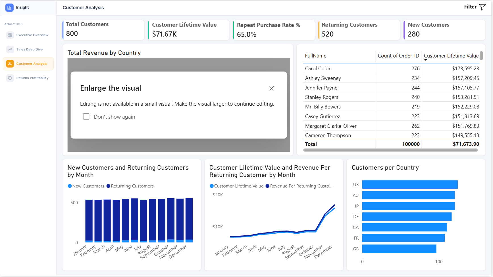
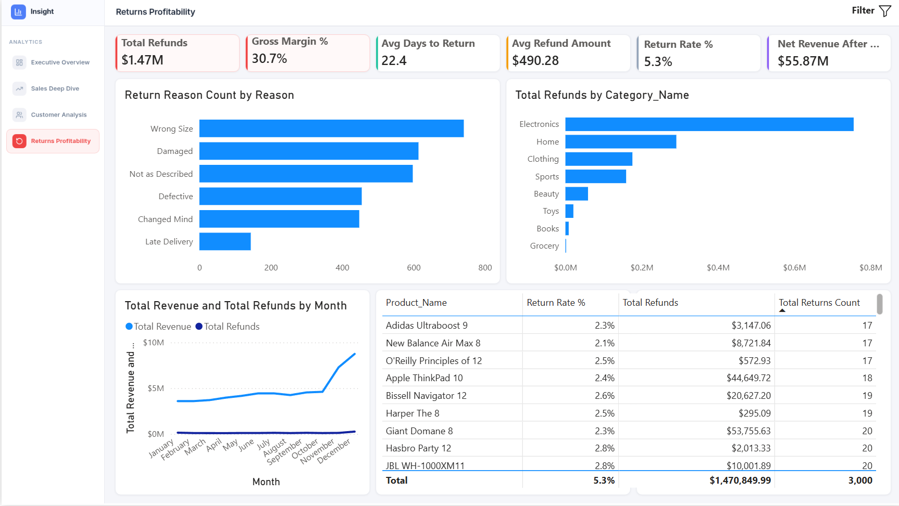

# Retail Analytics Data Warehouse

A comprehensive data warehouse solution for retail analytics, featuring dimensional modeling, ETL processes using SSIS, and analytical capabilities for sales, and returns.

##  Project Overview

This data warehouse project implements a star schema design to support retail business intelligence and analytics. It processes data from multiple source systems and provides insights into sales performance, product returns, and customer satisfaction.

##  Features

- **Dimensional Model**: Star schema with 6 dimensions and 2 fact tables
- **ETL Pipeline**: Complete SSIS package suite for data extraction, transformation, and loading
- **Data Quality**: Built-in validation, error handling, and auditing
- **Analytics**: Pre-built views and queries for common business questions
- **Power BI Dashboard**: 4-page interactive dashboard covering executive KPIs, sales, customers, and returns
- **Scalability**: Designed to handle millions of transactions

##  Architecture

### Fact Tables
- **FactSales**: Order-level sales transactions
- **FactReturns**: Product return transactions

### Dimension Tables
- **DimDate**: Pre-populated date dimension (2016-2030)
- **DimCustomer**: Customer information (SCD Type 2)
- **DimProduct**: Product catalog (SCD Type 2)
- **DimSupplier**: Supplier information
- **DimPaymentMethod**: Payment types
- **DimCampaign**: Marketing campaigns

##  Getting Started

### Prerequisites
- SQL Server 2016 or later
- SQL Server Integration Services (SSIS)
- SQL Server Management Studio (SSMS)
- Visual Studio with SQL Server Data Tools (SSDT) for SSIS development

### Installation

1. **Clone the repository**
```bash
   git clone https://github.com/sallam-0/ecommerce-data-warehouse.git
   cd ecommerce-data-warehouse
```

2. **Create the database**
```sql
    CREATE DATABASE database_name;
```

3. **Create dimension tables**

    Execute scripts in order from: [Dimensions Scripts](./Database_Scripts/Dimension_Tables/)


4. **Create fact tables**

    Execute scripts in order from: [Facts Scripts](Database_Scripts/Fact_Tables/)


5. **Deploy SSIS packages**
   - Open Visual Studio
   - Import SSIS packages from [SSIS_Packages](./SSIS_Packages)
   - Configure connection managers
   - Deploy to SQL Server


### Quick Start 

 Create source database
Restore database in [Source_Database](./Source_Database)


##  Documentation

Detailed documentation is available in the [Documentation](./Documentation/) folder:

- [Data Warehouse Design](Documentation/Star_Schema_Diagram.png)
- [Dimensional Model](Documentation/Dimensional_Model.md)
- [ETL Process Flow](Documentation/ETL_Process_Flow.md)

---

##  Power BI Dashboard

An interactive Power BI dashboard is built on top of this data warehouse, providing business-ready analytics across 4 dedicated pages.

| Page | Description |
|------|-------------|
| **Executive Overview** | High-level KPIs: Total Revenue ($57.34M), Net Revenue, AOV, Return Rate, and monthly revenue trends |
| **Sales Deep Dive** | Revenue by category, supplier, payment method, campaign performance, and top products |
| **Customer Analysis** | CLV ($71.67K), 65% repeat purchase rate, new vs. returning customers, and geographic breakdown |
| **Returns Profitability** | $1.47M refunds, return reasons, at-risk products, and refund-to-revenue trend |

### Dashboard Preview

| Executive Overview | Sales Deep Dive |
|---|---|
|  |  |

| Customer Analysis | Returns Profitability |
|---|---|
|  |  |

📄 **[View full dashboard documentation →](docs/dashboard/DASHBOARD.md)**

---


##  Sample Analytics Queries

### Sales Performance by Month
```sql
SELECT 
    d.Year,
    d.Month_Name,
    COUNT(DISTINCT f.Order_ID) AS Total_Orders,
    SUM(f.LineTotal) AS Total_Sales
FROM FactSales f
    INNER JOIN DimDate d ON f.OrderDate_Key = d.Date_Key
GROUP BY d.Year, d.Month, d.Month_Name
ORDER BY d.Year, d.Month;
```

### Top 10 Products by Return Rate
```sql
SELECT TOP 10
    p.Product_Name,
    COUNT(DISTINCT s.FactSales_Key) AS Total_Sales,
    COUNT(DISTINCT r.FactReturns_Key) AS Total_Returns,
    CAST(COUNT(DISTINCT r.FactReturns_Key) AS DECIMAL(10,2)) / 
        NULLIF(COUNT(DISTINCT s.FactSales_Key), 0) * 100 AS Return_Rate_Percent
FROM DimProduct p
    INNER JOIN FactSales s ON p.Product_Key = s.Product_Key
    LEFT JOIN FactReturns r ON p.Product_Key = r.Product_Key
WHERE p.Is_Current = 1
GROUP BY p.Product_Name
ORDER BY Return_Rate_Percent DESC;
```

##  ETL Process

The ETL pipeline follows this workflow:

1. **Extract**: Source data from operational databases
2. **Transform**: 
   - Data type conversions
   - Lookup dimension keys
   - Data validation and cleansing
   - Business rule application
3. **Load**: Insert into fact tables with error handling

##  Acknowledgments

- Star schema design based on Kimball methodology
- Inspired by retail analytics best practices
- Built with SQL Server and SSIS
